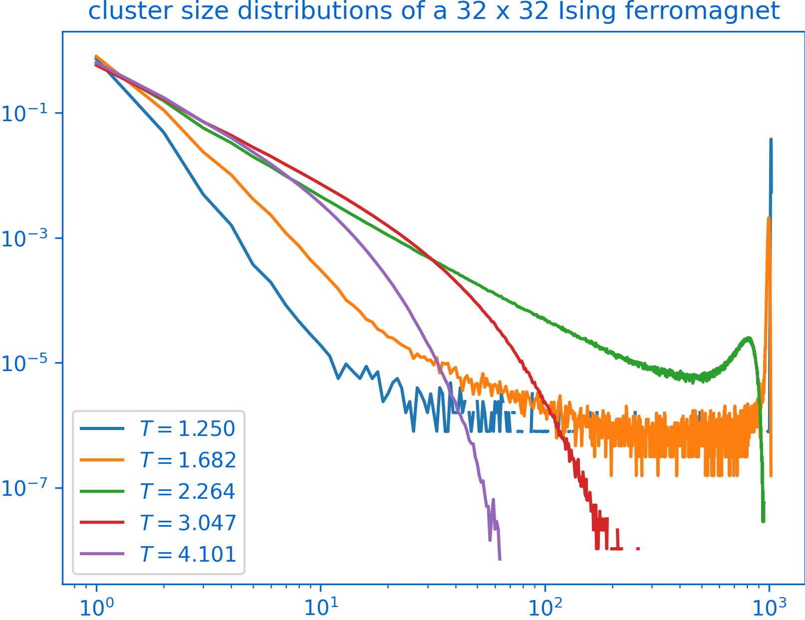

# PeaPods

The goal of this project is to build a Python library for simulating spin systems with modern efficient Monte-Carlo methods. 
The implementation aims to balance between performance and simplicity.

<div style="text-align:center">
  
</div>

## Description

Currently, this project is at the very early stages, 
and only supports simulating Ising ferromagnets and spin glasses. 
Development for other spin classes (Potts, clock, and O(N) models) are planned, 
including their disordered and quantum counterparts.

The following algoritms are currently supported:

- Single-spin flips
- [Cluster updates (only Wolff)](https://en.wikipedia.org/wiki/Wolff_algorithm)
- [Parallel tempering](https://en.wikipedia.org/wiki/Parallel_tempering)

The following algorithms are planned:

- Cluster updates for frustrated spin systems 
(e.g. [KBD algorithm](https://en.wikipedia.org/wiki/KBD_algorithm#:~:text=The%20KBD%20algorithm%20is%20an,algorithm%20more%20efficient%20in%20comparison.))
- [Replica cluster moves](https://en.wikipedia.org/wiki/Replica_cluster_move#:~:text=Replica%20cluster%20move%20in%20condensed,replicas%20instead%20of%20just%20one.) 
(e.g. [Houdayer move](https://arxiv.org/abs/cond-mat/0101116), 
[Jorg move](https://arxiv.org/abs/cond-mat/0410328)
)

## Quickstart

It is very easy to get started with simulating an (ensemble of) spin models.
For example, if we want to simulate an ensemble of 16 independent Ising ferromagnets
shaped 20 x 20, we can do the following:

```python
from spin_models import IsingEnsemble

ising_ensemble = IsingEnsemble(lattice_shape=(20, 20), n_ensemble=16)
ising_ensemble.sample(n_sweeps=2**14)
```

Note that code will try to start 16 parallel workers for simulation,
where each worker will maintain its own set of Ising models at different temperatures,
and simulate them for 2^14 sweeps.

For a more complete example, check out this [tutorial](tutorial.ipynb).

## Dependencies (numba)

The required dependencies should come with any standard Python installations. 
However, it is highly recommended that you install Numba for efficient simulation:

`pip install numba`

The complete list of dependencies is found in [requirements.txt](requirements.txt)

## Contribution

This is an open-source project, so everyone is welcomed to contribute! 

Please open an issue if you spotted a bug or suggest any feature enhancements. 
Submit a pull request if appropriate. 
Alternatively, contact me at yanrpei@gmail.com if you wish to be a contributor to this project.