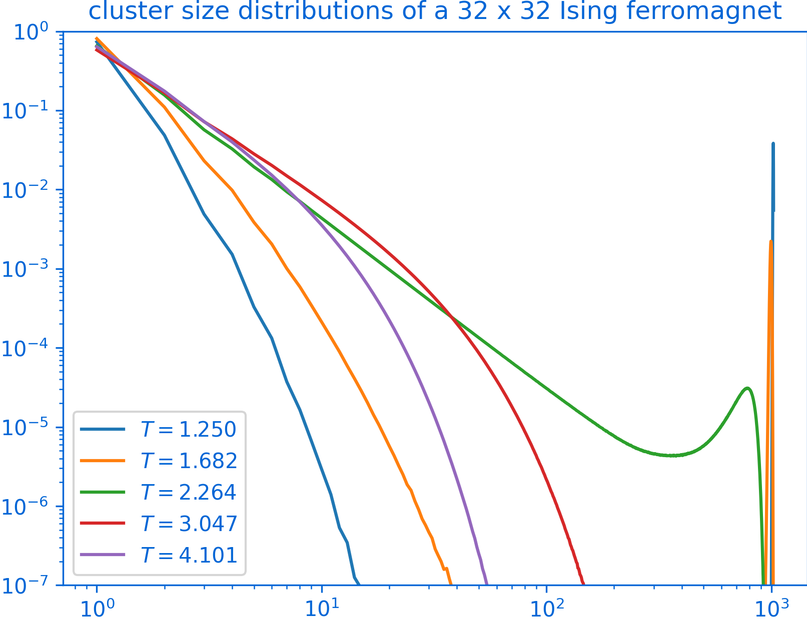

# PeaPods

[](https://github.com/PeaBrane/peapods/actions/workflows/ci.yml)
[](https://pypi.org/project/peapods/)
[](https://crates.io/crates/spin-sim)
[](https://docs.rs/spin-sim)
[](https://peabrane.github.io/peapods/)
[](LICENSE)

A Python library for simulating Ising spin systems with modern Monte Carlo methods.
The core simulation loop is written in Rust (via PyO3) for performance, with a thin Python wrapper for ease of use.

<div style="text-align:center">
  
</div>

## Features

- Ising ferromagnets and spin glasses on periodic Bravais lattices (hypercubic, triangular, or any custom neighbor offsets)
- Arbitrary, bimodal (±J), or Gaussian coupling distributions
- Multiple replicas with overlap statistics for spin glass order parameters

The following algorithms are currently supported:

- Single-spin flips ([Metropolis](https://en.wikipedia.org/wiki/Metropolis%E2%80%93Hastings_algorithm) and [Gibbs sampling](https://en.wikipedia.org/wiki/Gibbs_sampling))
- [Swendsen-Wang cluster updates](https://en.wikipedia.org/wiki/Swendsen%E2%80%93Wang_algorithm)
- [Wolff cluster updates](https://en.wikipedia.org/wiki/Wolff_algorithm)
- [Parallel tempering](https://en.wikipedia.org/wiki/Parallel_tempering)
- [Houdayer isoenergetic cluster move](https://arxiv.org/abs/cond-mat/0101116) (replica cluster move for spin glasses)
- [Jörg move](https://arxiv.org/abs/cond-mat/0410328) (stochastic overlap cluster move)
- [CMR move](https://doi.org/10.1103/PhysRevE.62.8114) (Chayes-Machta-Redner blue-bond overlap cluster move)

## Quickstart

Run simulations directly from the terminal:

```bash
# 2D ferromagnet with cluster updates and parallel tempering
peapods simulate --shape 32 32 --temp-min 1.5 --temp-max 3.0 \
    --n-sweeps 5000 --cluster-interval 1 --pt-interval 1 --n-replicas 2

# 3D spin glass with Houdayer ICM
peapods simulate --shape 8 8 8 --couplings bimodal \
    --temp-min 0.8 --temp-max 1.4 --n-temps 24 --n-sweeps 10000 \
    --pt-interval 1 --overlap-cluster-update-interval 1 --n-replicas 4

# Save full results to .npz
peapods simulate --shape 16 16 --temp-min 1.5 --temp-max 3.0 \
    --n-sweeps 5000 --pt-interval 1 --n-replicas 2 -o results.npz
```

For full control over geometry and parameters, use the Python API directly:

```python
import numpy as np
from peapods import Ising

# Triangular lattice ferromagnet (T_c = 4/ln(3) ≈ 3.641)
tri = Ising((32, 32), temperatures=np.linspace(3.0, 4.2, 32),
            n_replicas=2, neighbor_offsets=[[1, 0], [0, 1], [1, -1]])
tri.sample(n_sweeps=5000, sweep_mode="metropolis",
           cluster_update_interval=1, pt_interval=1)
print(tri.binder_cumulant)
```

For a more complete example, check out [examples/energy_vs_temperature.py](examples/energy_vs_temperature.py).

## Installation

We recommend [uv](https://docs.astral.sh/uv/) for package management. Bare `pip` works too (if you don't mind using a worse management tool).

```bash
uv venv
source .venv/bin/activate
uv pip install peapods
```

Pre-built wheels are available for Linux (x86_64, aarch64), macOS (Intel, Apple Silicon), and Windows (x86_64).

## Building from source

Requires a Rust toolchain and [maturin](https://www.maturin.rs/):

```bash
uv pip install maturin numpy
maturin develop --release
```
