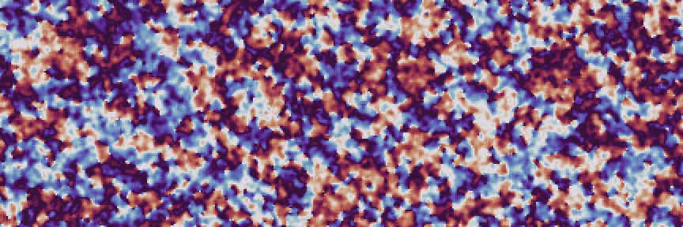
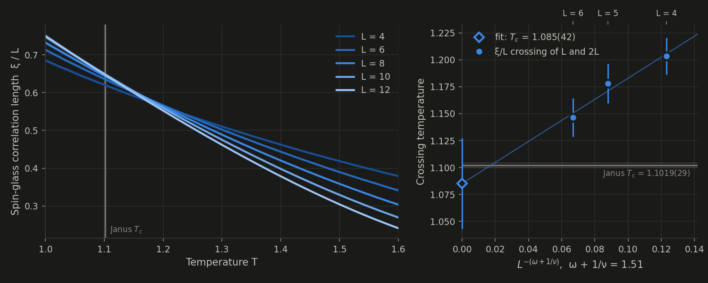

# PeaPods



A Python library for simulating Ising and XY spin systems with modern Monte Carlo methods.
The core simulation loop is written in Rust (via PyO3) for performance, with a thin Python wrapper for ease of use.

## Reproduces published results



The ξ/L crossings of the 3D ±J spin glass (L = 4 to 12) extrapolate to
T_c = 1.085(42), against the Janus collaboration's 1.1019(29). The 2D XY model at
β = 1.1199 matches Hasenbusch (2005) within 1.9 standard errors ([XY guide](xy.md)).
Scripts are in the repository's `validation/` directory.

## Features

- Ising ferromagnets and spin glasses on periodic Bravais lattices (hypercubic, triangular, or any custom neighbor offsets)
- Arbitrary, bimodal (±J), or Gaussian coupling distributions
- Multiple replicas with overlap statistics for spin glass order parameters
- XY vectors with signed couplings, site/bond dilution, embedded SW/Wolff and optional overrelaxation ([XY guide](xy.md))
- Metropolis, Gibbs, Swendsen-Wang, Wolff, parallel tempering, Houdayer ICM, Jörg, CMR, and replica Monte Carlo algorithms ([overlap moves guide](overlap_moves.md))

## Quickstart

```python
import numpy as np
from peapods import Ising

# 2D ferromagnet with cluster updates and parallel tempering
model = Ising((32, 32), temperatures=np.linspace(1.5, 3.0, 32), n_replicas=2)
model.sample(n_sweeps=5000, sweep_mode="metropolis",
             cluster_update_interval=1, pt_interval=1)
print(model.binder_cumulant)
```

## Installation

```bash
uv pip install peapods
```

Pre-built wheels are available for Linux (x86_64, aarch64), macOS (Intel, Apple Silicon), and Windows (x86_64).
