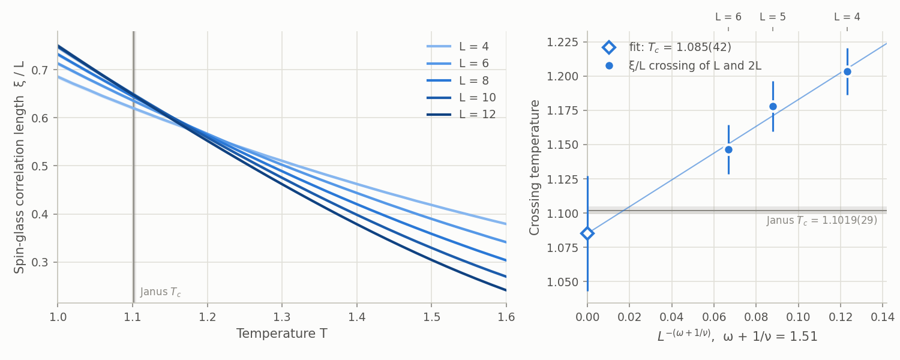

# 3D ±J spin glass: ξ/L crossings near T_c

Reproduces the finite-size crossings of the spin-glass correlation length that locate
the transition of the three-dimensional Edwards–Anderson model with ±J couplings, and
compares them with Baity-Jesi et al. (Janus), [PRB 88, 224416 (2013)](https://arxiv.org/abs/1310.2910):
T_c = 1.1019(29), ξ/L = 0.6516(32) and U4 = 1.4899(28) at T_c.

## Result



| (L, 2L) | T* from ξ/L | ξ/L at T* | T* from U4 |
|---|---|---|---|
| (4, 8) | 1.204(17) | 0.561 | 1.130(37) |
| (5, 10) | 1.178(19) | 0.578 | 1.138(28) |
| (6, 12) | 1.146(18) | 0.603 | 1.107(30) |

Fitting T*(L, 2L) = T_c + a L^-(ω+1/ν) with Janus's ω + 1/ν = 1.51 gives
T_c = 1.085(42) (χ² = 0.21 for one degree of freedom), consistent with 1.1019(29). The
crossings drift down and ξ/L at the crossing drifts up toward 0.652, as expected for
lattices this small; the extrapolation leans on the fixed correction exponent, so it is
a consistency check rather than an independent T_c. Every size was equilibrated well
before its last window (at T = 1.0 the last two windows agree within 1.5 paired
standard errors for every size, with no trend), and the minimum parallel-tempering acceptance was 0.79 at L = 12.
[`summary.json`](summary.json) holds every number in the figure.

## Method

- Periodic L³ lattices, couplings ±1 with equal probability, two replicas per sample.
- 31 temperatures from 1.0 to 1.6. Every sweep is one Metropolis sweep of all replicas
  followed by one parallel-tempering pass over the full ladder.
- `sample(collect_physics=True)` records per sample the replica overlap moments
  ⟨q²⟩, ⟨q⁴⟩ and the overlap structure factor χ(k_min) at k_min = 2π/L along each
  axis. Then ξ = √(χ(0)/χ(k_min) − 1) / (2 sin(k_min/2)) with χ(0) = N[⟨q²⟩], and
  U4 = [⟨q⁴⟩]/[⟨q²⟩]², where [·] averages over disorder after the thermal average.
- Each chain runs as consecutive `sample()` calls covering the windows [2^k, 2^(k+1))
  sweeps. Results use the last window (the second half of the run); equilibration is
  checked by comparing earlier windows with it on the same samples.
- Errors are delete-one-block jackknife over 64 blocks of disorder samples. A crossing
  is the highest temperature where the curves of L and 2L intersect, by linear
  interpolation on the temperature grid.

## Commands

```sh
# Simulate one size (resumable: finished batches are skipped).
python run.py --size 8 --n-disorder 3840 --log2-sweeps 16 --out data
# Reduce all sizes in data/ to summary.json, then draw the figure.
python analyze.py data --out summary.json
python plot.py summary.json --out ../../docs/assets/spin_glass_3d_tc
```

The reference run used `--n-disorder 3840` for every size, with `--log2-sweeps` 14
(L = 4, 5), 15 (L = 6), 16 (L = 8), 17 (L = 10) and 18 (L = 12): at least eight times
the equilibration time measured in a pilot. It took 5.3 hours on 96 Arm Neoverse-V2
cores, 3.7 of them for L = 12. It predates the full-ladder fix of 2026-10-03, which
makes parallel tempering move walkers along the ladder 10–40× faster; sampling was
correct before, so the results stand, and a rerun would equilibrate sooner.
